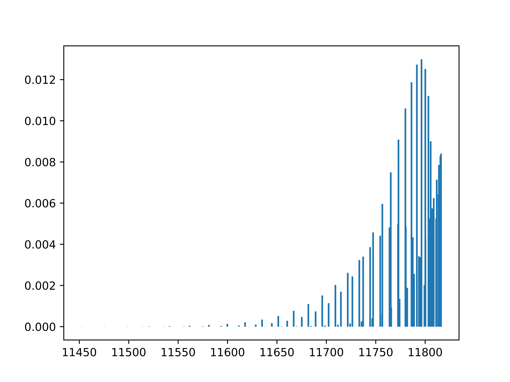

# pgopher-py

## Demo

```py
from pgopher_py import (
    simulate_spectrum,
    LinearGroundState,
    LinearExcitedState,
    Lambda,
    Parity,
)
from matplotlib import pyplot as plt
from dotenv import load_dotenv

load_dotenv()

res = simulate_spectrum(
    ground=LinearGroundState(
        spin_multiplicity=2,
        lambda_symmetry=Lambda.SIGMA_PLUS,
        rotational_constant=1.9812707,
    ),
    excited=LinearExcitedState(
        spin_multiplicity=2,
        lambda_symmetry=Lambda.PI,
        rotational_constant=1.5928686,
        origin=11807.956423,
        parity=Parity.gerade,
    ),
    temperature=200,
    # print_xml_input=True,
)

plt.stem(res.energies, res.intensities, markerfmt=" ", basefmt=" ")
plt.savefig("test.png", dpi=1200)
```



## Obtaining PGOPHER

Download https://pgopher.chm.bris.ac.uk/download/pgopher-x86_64-linux-gtk2.tgz and extract it.

Set an environment variable `PGOPHER_PATH` with the absolute path of `pgo`. In the above example, an `.env` file is used:

```env
PGOPHER_PATH = "/absolute/path/to/pgo"
```

## Developing

Create a virtual environment:

```bash
python -m venv ~/venvs/pgopher_py_dev
```

Activate the virtual environment:

```bash
source ~/venvs/pgopher_py_dev/bin/activate
```

Then install the package with:

```bash
pip install .
```
